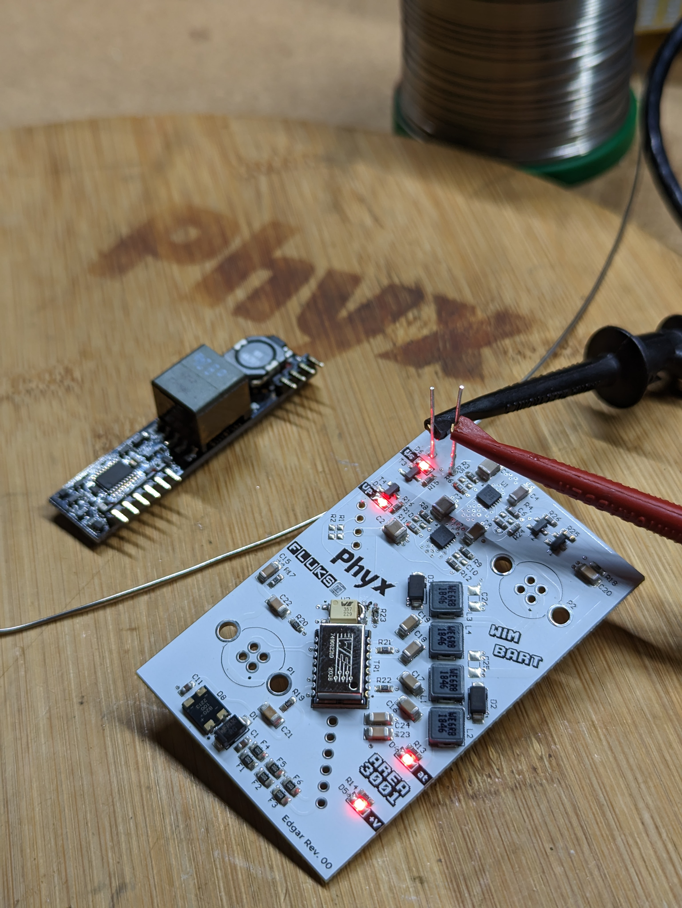
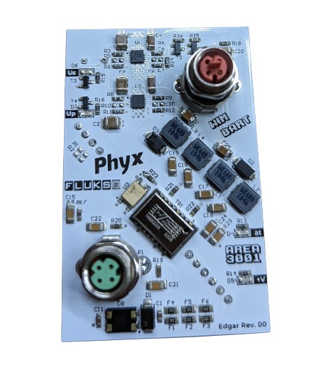

# EDGAR
EDGAR is a PoE to EtherCAT P module delivering 300mA on the Us rail and 660mA on the Up rail. However, during bootup it will keep the Up rail disabled and boost the current limit of the Us rail to 745mA in order to ensure proper startup of the connected modules. Keep in mind that the power will only be enabled if an 802.3at PoE PSE is detected.

The board is built around the [Silvertel AG5424](https://silvertel.com/ag5400/), 30W 24V DC PoE module and implements 2 [Texas Instruments TPS26625](https://www.ti.com/product/TPS2662) eFuses for splitting the power rail.

# REV 00
First prototype to verify the working principle using an M8-D coded 10/100 Ethernet connector and a M8-P Coded EtherCAT P connector.

